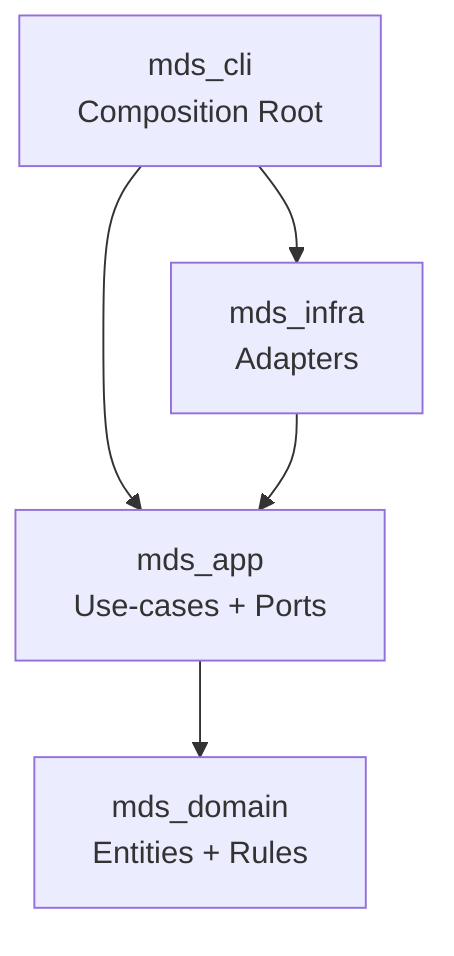
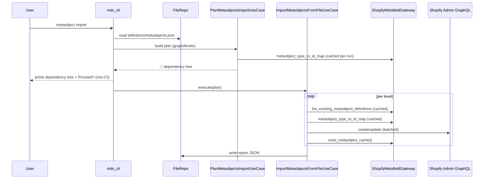

# 🦀 Meta Definition Sync CLI, built with Rust

```
🦀  safety • performance • correctness
```

> ⚠️ NOTE: This Rust project was created **to learn Rust** while implementing the same CLI surface and behavior as the earlier implementation (metafields + metaobjects sync). Treat it as production tooling only after you’ve validated it in a development store.

A CLI for importing/exporting **Shopify metafield and metaobject definitions** via the **Admin GraphQL API** (API version: `2025-10`).

---

## ✨ Features

### 🔧 Metafield definitions
- ✅ **Export** to JSON per owner type (filters namespaces starting with `shopify`)
- ✅ **Import** from JSON (create / update / recreate / no-change)
- ✅ **Batching + rate-limit UX**: batches of 10 + 1000ms delay with progress logs
- ✅ **Change detection**: only updates when configs differ
- ✅ **Cross-environment metaobject references**:
  - export converts `metaobject_definition_id` → `metaobject_definition_type`
  - import resolves `metaobject_definition_type` → `metaobject_definition_id`
- ✅ **Reports** written to `reports/…` after imports

### 🏗️ Metaobject definitions
- ✅ **Export** to `definitions/metaobjects.json` (filters system types starting with `shopify--`)
- ✅ **Import** from `definitions/metaobjects.json`
  - prints a **dependency tree** (like a project folder tree) before mutating Shopify
  - imports **level-by-level** so referenced types exist before dependents
- ✅ **Batching + rate-limit UX**: batches of 10 + 1000ms delay between batches and levels
- ✅ **Per-run caching** of Shopify lookups to avoid repeated GraphQL calls (cache reset between levels)
- ✅ **Reports** written to `reports/…` after import

---

## 🎯 Supported metafield owner types

Metafield export/import supports:

- **Products** (`PRODUCT`)
- **Product Variants** (`PRODUCTVARIANT`)
- **Orders** (`ORDER`)
- **Pages** (`PAGE`)
- **Shop** (`SHOP`)
- **Collections** (`COLLECTION`)
- **Customers** (`CUSTOMER`)
- **Blogs** (`BLOG`)
- **Blog Articles** (`ARTICLE`)
- **Markets** (`MARKET`) ✨ *(API version 2025-10)*

---

## 📋 Prerequisites

- Rust toolchain (stable)
- A Shopify store with Admin API access
- An app token with appropriate permissions:
  - `read_metaobject_definitions`, `write_metaobject_definitions`
  - metafield definition read/write permissions for the owner types you manage

---

## 🔐 Configuration (env files)

The CLI scans the **current working directory** for:

- `.env` (default)
- `.env.<name>` (named env, e.g. `.env.staging`)

Required variables:

- `MDS_CLI_SHOPIFY_SHOP_DOMAIN` (e.g. `your-shop.myshopify.com`)
- `MDS_CLI_SHOPIFY_ACCESS_TOKEN`

Optional variables:

- `MDS_LOG_FORMAT`: `pretty` (default) or `json`

---

## 🚀 Quickstart

From the repo root:

```bash
cd rust-rewrite

# Export metafields for one owner type
cargo run -p mds_cli -- metafield export --owner-type PRODUCT

# Export all metafields
cargo run -p mds_cli -- metafield export --owner-type ALL

# Import metafields for one owner type (interactive selection if not --ci)
cargo run -p mds_cli -- metafield import --owner-type PRODUCT

# Export metaobjects
cargo run -p mds_cli -- metaobject export

# Import metaobjects (prints dependency tree first)
cargo run -p mds_cli -- metaobject import
```

---

## 🧾 I/O contracts (what files the CLI reads/writes)

All paths are resolved relative to the **current working directory**.

### 📥 Inputs
- **Metafields (per owner type)**:
  - `definitions/metafields/<ownerTypeLowercase>.json`
  - example: `definitions/metafields/product.json`
- **Metaobjects**:
  - `definitions/metaobjects.json`

If an input file is missing during import, the CLI fails and prints a hint command to generate it via export.

### 📤 Export outputs
- **Metafields export**:
  - `definitions/metafields/<ownerTypeLowercase>.json`
- **Metaobjects export**:
  - `definitions/metaobjects.json`

### 🧪 Import reports
After imports, detailed JSON reports are saved:

- **Metafields import**:
  - `reports/metafield-definitions:import/metafield-import-report-<timestamp>.json`
- **Metaobjects import**:
  - `reports/metaobject-definitions:import/metaobject-import-report-<timestamp>.json`

---

## 🖥️ CLI surface (commands & flags)

### Global flags
- `--ci`: disables interactive prompts
- `--environment <name>`: selects `.env.<name>`
  - in `--ci` mode, if multiple env files exist, `--environment` is required

### `metafield export`
- `--owner-type <TYPE|TYPE1,TYPE2|ALL>`

### `metafield import`
- `--owner-type <...>` *(required in CI; in non-CI can be selected interactively)*
- `--allow-type-changes`
- `--allow-associated-metafields-deletion`

### `metaobject export`
- no additional flags

### `metaobject import`
- currently imports from `definitions/metaobjects.json`
- prints a dependency tree before applying mutations

---

## 🧠 Clean Architecture (what we used and why)

This Rust workspace is structured using **Clean Architecture** so that:

- business rules stay independent from IO/frameworks
- Shopify/FS/CLI can be swapped or tested in isolation
- long-term changes (diff, prune, more safety) remain understandable

### 📦 Workspace layout

```text
rust-rewrite/
├─ Cargo.toml
├─ crates/
│  ├─ mds_domain/   # domain entities + value objects (pure)
│  ├─ mds_app/      # use-cases + ports + DTOs (no IO)
│  ├─ mds_infra/    # adapters: Shopify GraphQL, filesystem, env loader
│  └─ mds_cli/      # CLI binary (clap + prompts + wiring)
└─ definitions/     # exported definitions (written/read by CLI)
```

### 🔁 Dependency direction



### 🧩 Ports & adapters (example)

- **Port** (`mds_app`): `MetaobjectImportGateway`
  - describes *what the app needs* (list existing, create/update, type↔id map, cache reset)
- **Adapter** (`mds_infra`): `ShopifyMetafieldGateway`
  - implements those methods using Shopify GraphQL + DTO mapping

### 🧭 Use-case orchestration (metaobject import)



---

## ✅ TODO (Rust rewrite)

The Rust rewrite lives in `rust-rewrite/`. The roadmap is intentionally kept inside this README (the `docs/` folder may be removed later).

- **Diff commands**
  - `mds-cli metafield diff --owner-type ...`
  - `mds-cli metaobject diff`
- **Deletions / pruning (explicit & guarded)**
  - `mds-cli metaobject import --allow-deletion` (Node parity)
  - `mds-cli metaobject prune` / `mds-cli metaobject fields-prune`
  - `mds-cli metafield prune --owner-type ...`
- **E2E smoke tests (CI-gated)**
  - dedicated Shopify dev/test store
  - minimal export/import smoke suite (non-destructive by default)

### Expanded roadmap (logical order; production-ready focus)

- **A0 — Diff commands (safety rail)**
  - **Metafields diff**:
    - compare `definitions/metafields/<owner>.json` vs Shopify
    - output planned create/update/recreate/delete (stable ordering for golden tests)
  - **Metaobjects diff**:
    - compare `definitions/metaobjects.json` vs Shopify
    - output planned create/update/delete + missing deps + cycle diagnostics

- **A1 — Metaobject deletion parity (`--allow-deletion`)**
  - wire `metaobject import --allow-deletion` to delete definitions not present in JSON (batched + delayed)
  - write deletions into report summary/items
  - keep default non-destructive behavior

- **A1b — Metafield prune command (explicit deletions)**
  - add `mds-cli metafield prune --owner-type ...` with a guard flag (e.g. `--yes` / `--allow-deletion`)
  - compute “extra definitions” and delete in batches with delays

- **A2 — Metaobject field deletions (explicit opt-in)**
  - add either:
    - `metaobject fields-prune` (recommended), or
    - `metaobject import --allow-field-deletion`
  - implement delete-by-key operations only when explicitly enabled

- **B1 — Reliability (retries + rate limiting)**
  - add safe retries (429/5xx/network) with exponential backoff + jitter
  - keep idempotency in mind (avoid double-create)

- **B2 — Diagnostics**
  - cycle errors should show a readable **cycle path**
  - missing dependency output should show “who depends on what”

- **C1 — Golden tests**
  - golden JSON for exports
  - golden dependency tree output
  - golden report shapes

- **C2 — Integration tests (no Shopify)**
  - run CLI against fixture files + fake gateways + temp filesystem
  - assert exit codes + created outputs

- **C3 — E2E smoke tests (Shopify; CI-gated)**
  - a dedicated test store/environment
  - minimal export/import smoke suite (non-destructive)
  - destructive E2E tests only if fully isolated and explicitly gated

---

## 🧪 Development

Run tests:

```bash
cd rust-rewrite
cargo test --workspace
```

